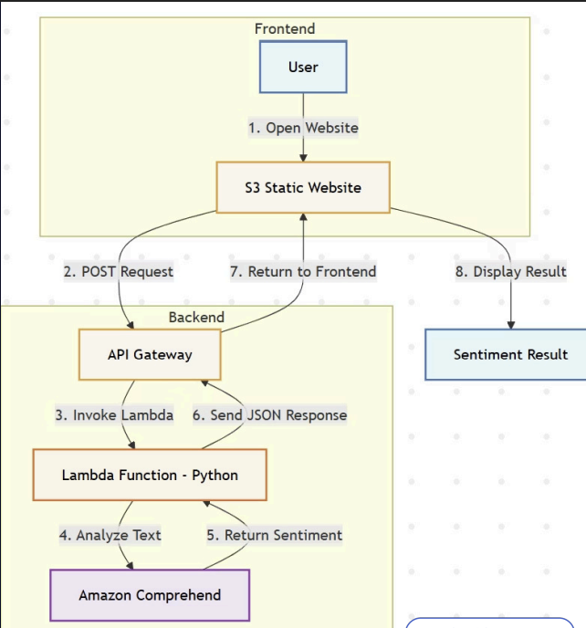
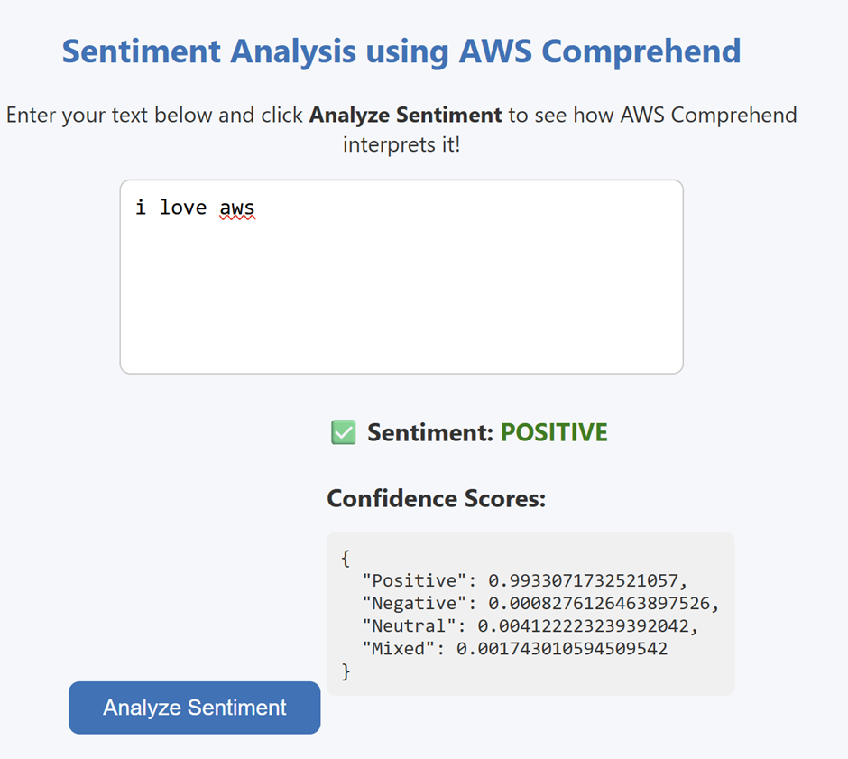

# 🧠 Serverless Sentiment Analysis System using AWS Lambda and API Gateway

A fully serverless sentiment analysis web application built using **AWS Cloud Services**.  
The app allows users to input text on a static website hosted on Amazon S3, which then sends the text to an API Gateway endpoint integrated with a Lambda function. The Lambda function invokes **Amazon Comprehend** to analyze sentiment and returns the result in real time.

---

## 🚀 Features

- 🌐 **Serverless Architecture** — No servers to manage, fully event-driven.
- 💬 **Real-Time Sentiment Detection** — Powered by AWS Comprehend.
- ⚡ **Lightweight Frontend** — Simple HTML + JS hosted on S3.
- 🧩 **Secure API** — Built using Amazon API Gateway and AWS Lambda.
- 💡 **Scalable** — Automatically scales based on incoming requests.

---

## 🏗️ System Architecture

````

---

## 🧰 AWS Services Used

| Service                 | Purpose                                                             |
| ----------------------- | ------------------------------------------------------------------- |
| **AWS Lambda (Python)** | Executes backend code to analyze sentiment using Amazon Comprehend. |
| **Amazon API Gateway**  | Exposes a public HTTP endpoint for frontend → Lambda communication. |
| **Amazon Comprehend**   | Detects sentiment (`POSITIVE`, `NEGATIVE`, `NEUTRAL`, `MIXED`).     |
| **Amazon S3**           | Hosts the static HTML and JavaScript frontend.                      |
| **AWS CLI & SAM**       | Used for deployment, configuration, and testing locally.            |

---

## 🪶 Project Structure

```
.
├── lambda_function.py     # AWS Lambda handler
├── index.html             # Frontend webpage
└── README.md              # Project documentation
```

---

## ⚙️ Deployment Steps

### 1️⃣ Create and Deploy the Lambda Function

```bash
zip function.zip lambda_function.py
aws lambda create-function \
  --function-name aws-sentimentt \
  --runtime python3.12 \
  --role arn:aws:iam::<your-account-id>:role/<lambda-execution-role> \
  --handler lambda_function.lambda_handler \
  --zip-file fileb://function.zip
```

### 2️⃣ Create an API Gateway (HTTP API)

```bash
aws apigatewayv2 create-api \
  --name SentimentAPI \
  --protocol-type HTTP \
  --target arn:aws:lambda:<region>:<account-id>:function:aws-sentimentt
```

Enable CORS:

```bash
aws apigatewayv2 update-api \
  --api-id <api-id> \
  --cors-configuration AllowOrigins='[*]',AllowMethods='GET,POST,OPTIONS',AllowHeaders='*'
```

### 3️⃣ Test API

```bash
curl -X POST \
  -H "Content-Type: application/json" \
  -d '{"text":"I love AWS!"}' \
  https://<api-id>.execute-api.<region>.amazonaws.com/
```

### 4️⃣ Host Frontend on S3

```bash
aws s3 mb s3://aws-sentimentt
aws s3 website s3://aws-sentimentt/ --index-document index.html
aws s3 cp index.html s3://aws-sentimentt/
```

Enable static website hosting and make it public (via console or policy).

---

## 💻 How It Works

1. **User** opens the S3-hosted web page and enters text.
2. The **frontend (JavaScript)** sends a POST request to the API Gateway endpoint.
3. **API Gateway** triggers the **Lambda function**.
4. The Lambda function calls **Amazon Comprehend** to detect sentiment.
5. The response is sent back to the web page and displayed.

---

## 🧪 Example Output

**Input:**

```
I love working with AWS!
```

**Output:**

```json
{
  "Sentiment": "POSITIVE",
  "SentimentScore": {
    "Positive": 0.998,
    "Negative": 0.0002,
    "Neutral": 0.0011,
    "Mixed": 0.0006
  }
}
```

---

## 🧠 Learnings

* Implemented **CORS** between S3 static frontend and API Gateway.
* Integrated multiple AWS services seamlessly.
* Understood **event-driven**, **stateless**, and **scalable** architectures.
* Used AWS CLI for quick provisioning and testing.

---

## 🏁 Future Enhancements

* Add multi-language sentiment support.
* Include entity and key phrase extraction.
* Build a React/Next.js version with API Gateway authentication.
* Store analysis history in DynamoDB.

---

## 🧑‍💻 Author

**Shruthi Reddy**
*Cloud Architecture Design Project — VIT Chennai*
*“Serverless Sentiment Analysis using AWS Lambda and API Gateway”*

---

## 🪪 License

This project is licensed under the MIT License — free to use and modify.

```

